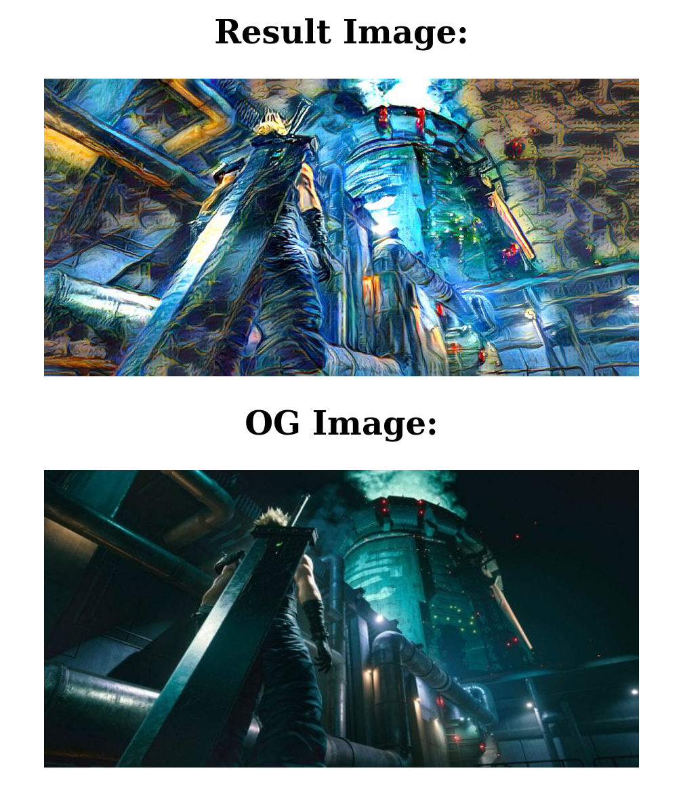
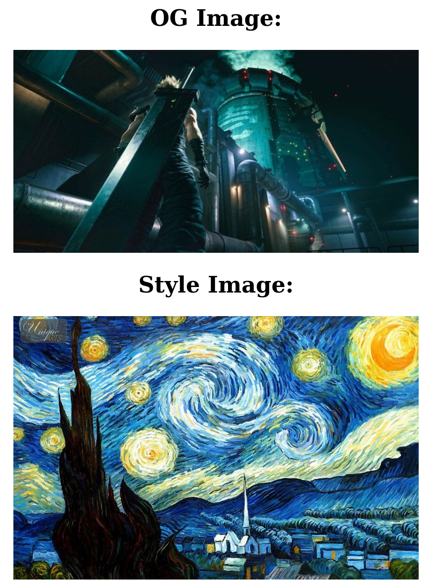

# Scalable Style Transfer

Website written in Python deployed on AWS with Docker and Kubernetes to be easily scaled as required.

## Screenshots





## How to run

```
sh run.sh
```

## Technologies Used 
- K8S
- Kafka
- robinhood/faust
- Docker
- AWS
- DeepAI API
- Flask
- Python
- HTML & CSS

## Future work
- Improve UI
- Add video capability
- Automate testing
- Faster neural nets
- Predictive models for AWS usage

## Created by
- [baibhavatsa](https://github.com/baibhaVatsa)
- [anmaithien](https://github.com/anmaithien)

